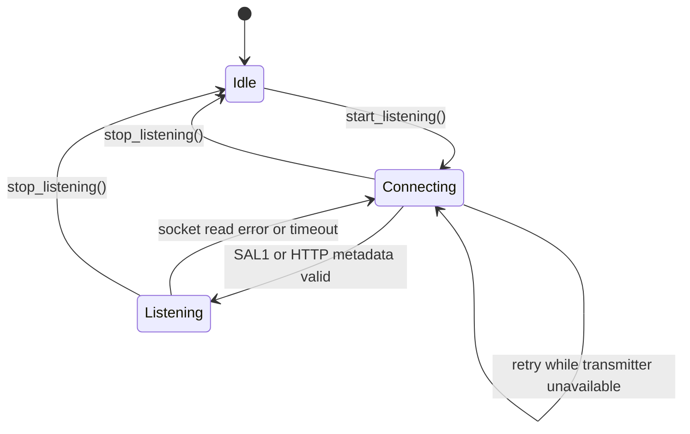

# ShareAudioPC

ShareAudioPC is the user-facing name of the native Windows/Linux LAN audio transmitter and receiver for low-latency local-network audio sharing. A machine can run as a transmitter, capturing local system audio and broadcasting it over TCP, as a receiver, connecting to another transmitter and playing the stream locally, or through the GUI as both at the same time.

The CMake project identifier and CLI help text still use the historical name `ShareAudioLite`; the GUI title, tray, dialogs, diagnostics, and browser page use `ShareAudioPC`.

The original idea was a Windows-native C#/WinUI application. The current implementation is a native C++20/CMake codebase with:

- `shareaudio_cli`: console application, built by default and by the Windows presets.
- `shareaudio_gui`: optional Qt Widgets desktop application, built when `SHAREAUDIO_ENABLE_DESKTOP_UI=ON` and Qt6 Widgets is available.
- `shareaudio_tests`: automated test binary, built when `SHAREAUDIO_ENABLE_TESTS=ON`.

This file is the consolidated technical reference for the project. Recent change history is in `docs/CHANGELOG.md`; planned work is in `docs/PLAN.md`.

## Implementation Snapshot

Current implementation:

- Language: C++20.
- Current project version: `0.4.0`.
- Build system: CMake with Windows presets currently present.
- Audio backend: miniaudio.
- Networking: standalone Asio.
- Codec: libopus through CMake integration when `SHAREAUDIO_ENABLE_OPUS=ON`.
- Default TCP port: `33777`.
- Native stream protocol: raw TCP with a 16-byte `SAL1` header.
- Browser/mobile compatibility: hybrid TCP/HTTP auto-detect with `/info`, `/stream`, and `/`.
- Audio format: 48 kHz, stereo, signed 16-bit PCM, little-endian.
- Supported `AudioMode` selection: Balanced, Fast, and Efficient. Balanced/Fast are PCM streaming modes. Efficient uses the Opus codec components described in the AudioMode section.
- Supported transmitter `VolumeMode`: Full preserves captured samples; Windows-only System follows the selected output endpoint master volume.
- Supported runtime roles: transmitter, receiver, and GUI simultaneous transmitter/receiver.
- Receiver reconnection: automatic retry loop after transmitter disconnects.
- Loop prevention: local/self IP connections are rejected.
- Persistence: recent devices and config JSON helpers.
- Portable startup config: `shareaudio.cfg` next to executable.
- Single-instance behavior: PID lock file handling.
- GUI: Qt Widgets, simple/advanced layout, system tray support, embedded icon/resources, default device pre-selection.
- GUI visual system: light Qt desktop workspace with a flat status strip, two equal Sharing/Receiver panels, semantic green/blue/red accents, advanced tabs, and a persistent footer.

Implemented components include:

- `AppConfig`, validation, and JSON persistence helpers.
- Logging with error, warning, info, and debug levels.
- `Result<T>` and project error codes.
- `AudioFormat`, `AudioMode`, `NetworkConfig`, `TransmitterConfig`, `ReceiverConfig`, and `AppConfig` models.
- `IAudioCapture` and `IAudioPlayback` abstractions.
- miniaudio capture/playback backend with device notification/disconnect callbacks.
- Generated tone and null audio test backends.
- PCM packet chunker.
- Fixed-size jitter buffer.
- TCP server/client primitives.
- PCM broadcast server.
- Local IPv4/IPv6 enumeration and self-connection blocking.
- Recent devices storage.
- Opus encoder and decoder wrappers.
- Qt-free `SessionController` shared by CLI and GUI.
- Optional Qt Widgets tabbed GUI.
- Windows resource script for `logo.ico`.
- Qt resource file for `logo.png` and `logo.svg`.
- Static-linked MinGW C++ runtime for portable Windows artifacts where applicable.
- Hybrid TCP/HTTP server auto-detection with a 150ms preview window.
- HTTP receiver fallback with metadata JSON parsing.

## Source Tree Map

The project is organized around a reusable `shareaudio_core` library plus thin CLI/GUI entrypoints.

| Path | Responsibility |
| --- | --- |
| `src/main.cpp` | CLI entrypoint. |
| `src/gui/main.cpp` | Qt GUI entrypoint. |
| `src/app/` | Application orchestration, config, logging, result/error types, startup config, single-instance handling, and session controller. |
| `src/audio/` | Audio interfaces, audio data types, capture/playback abstractions, miniaudio backend, and audio pipeline helpers. |
| `src/codec/` | Opus encoder/decoder wrappers and codec integration. |
| `src/network/` | TCP socket wrapper, loopback network test helper, and PCM broadcast server. |
| `src/platform/` | Platform-specific local IP enumeration. |
| `src/protocol/` | `SAL1` protocol encoding/decoding, PCM chunking, and jitter buffer. |
| `src/storage/` | Recent transmitter/device persistence. |
| `src/ui/` | Console UI command parser and CLI user interaction. |
| `src/gui/` | Qt Widgets main window and GUI behavior. |
| `tests/` | Automated test binary source. |
| `third_party/` | Vendored dependencies such as miniaudio and standalone Asio. |

Important source files:

- `src/app/SessionController.cpp`: shared runtime state machine for CLI and GUI.
- `src/app/StartupConfig.cpp`: `shareaudio.cfg` loading and parsing.
- `src/app/SingleInstance.cpp`: PID lock and old-instance handling.
- `src/audio/MiniaudioBackend.cpp`: real capture/playback backend.
- `src/audio/AudioPipeline.cpp`: transmitter/receiver audio pipeline helpers.
- `src/codec/OpusCodec.cpp`: libopus-backed encoder/decoder wrapper.
- `src/network/PcmBroadcastServer.cpp`: TCP server, client classification, HTTP routes, and audio broadcasting.
- `src/network/TcpSocket.cpp`: client socket operations and exact read/write helpers.
- `src/protocol/Protocol.cpp`: `SAL1` header and packet framing helpers.
- `src/protocol/PcmChunker.cpp`: fixed-size PCM packetization.
- `src/protocol/JitterBuffer.cpp`: receiver-side buffering.
- `src/platform/LocalIp.cpp`: local IP enumeration and self-connection support.
- `src/storage/RecentDevices.cpp`: recent device/IP persistence.
- `src/ui/ConsoleUi.cpp`: CLI commands and help text.
- `src/gui/MainWindow.cpp`: Qt dashboard, simple/advanced mode, config prefill, and UI actions.
- `src/gui/Theme.cpp`: static Qt stylesheet for the light desktop GUI and state-based GUI styling.

## Repository Documentation Policy

Project documentation lives under `docs`:

- `docs/README.md`: full technical reference.
- `docs/CHANGELOG.md`: recent and staged changes.
- `docs/PLAN.md`: planned-work checklist only.
- `docs/BUILD.md`: command-only build reference.
- `docs/DESIGN.md`: product GUI design requirements.
- `docs/stitch_concept/`: visual concept references; conceptual controls are not runtime requirements.

Third-party documentation under `third_party/` belongs to vendored dependencies and is outside this documentation consolidation policy.

## User-Facing Applications

### CLI Binary

`shareaudio_cli` is the default user-facing binary. It is built by the provided Windows presets and by manual CMake builds unless `SHAREAUDIO_ENABLE_CONSOLE_UI=OFF`.

Supported commands:

```bash
shareaudio_cli share
shareaudio_cli share --audio-mode balanced
shareaudio_cli share --audio-mode fast
shareaudio_cli share --audio-mode efficient
shareaudio_cli share --volume-mode system
shareaudio_cli share --device "playback:1"
shareaudio_cli listen 192.168.1.150
shareaudio_cli listen 192.168.1.150 --device "playback:2"
shareaudio_cli devices
shareaudio_cli ips
shareaudio_cli help
```

Command behavior:

- `share` starts transmitter mode on TCP port `33777`.
- `share` defaults to Balanced AudioMode when `--audio-mode` is omitted.
- `share --audio-mode fast` uses smaller PCM packets for lower latency.
- `share --audio-mode efficient` selects the Opus/Efficient code path.
- `share --volume-mode full` preserves the captured signal and is the default.
- `share --volume-mode system` applies the Windows output endpoint master volume to transmitted audio. Other platforms continue with Full and print a warning.
- `share --device <device_id>` selects a capture/loopback source.
- `listen <host>` starts receiver mode and autodetects stream mode from `SAL1` or HTTP metadata.
- `listen <host> --device <device_id>` selects the playback device.
- `devices` lists capture/playback devices.
- `ips` lists local IP addresses.
- `help` prints the user-facing command summary.

When transmitter mode starts, the CLI prints available local IP addresses so another device can connect to the correct LAN address.

Removed legacy flags:

- `--status`
- `--start-transmitter`
- `--connect`
- `--transmit-pcm`
- `--receive-pcm`
- `--list-ips`
- `--list-audio-devices`

### GUI Binary

`shareaudio_gui` is an optional Qt Widgets target enabled when Qt is available and `SHAREAUDIO_ENABLE_DESKTOP_UI` is active.

The GUI uses the same Qt-free `SessionController` as the CLI. It is not a separate runtime implementation.

The GUI uses a light desktop workspace inspired by native Qt/Windows utility applications: a flat global status strip, two equal primary Sharing/Receiver panels, semantic green Sharing accents, blue Receiver accents, amber connection warnings, and red stop/error states. Advanced mode extends the same top-level workspace instead of replacing it.

Simple mode:

- Opens at a target size of `1086x660`, with minimum `920x620` when the screen permits.
- Keeps the global state, local IP, TCP port, receiver summary, latest error row, Sharing action, Receiver host/action, `Follow system volume`, and `Minimize to tray` visible.
- Uses a flat status strip plus a separate highlighted error row only when a real error exists.
- Uses two equal primary panels: `SHARING (Transmitter)` on the left and `RECEIVER` on the right.
- Sharing and Receiver remain independent and can run simultaneously.

Advanced mode:

- Targets `1366x900` with a normal minimum of `1180x760`, clamped to the current screen's available area.
- Uses responsive matrix layouts: Sharing and Receiver stay side by side when there is enough width and stack vertically when the window becomes narrow; advanced tab sections also stack to avoid overlap.
- Adds the exact AudioMode options `Balanced (Recommended)`, `Fast (Low Latency)`, and `Efficient (Low Data)`.
- Adds capture/playback device selection, refresh actions, connected-client count, detected stream mode, current applied system-volume gain, and an informational volume slider without moving the primary Simple controls.
- Shows the `Network & Hardware` tab with local IPs, recent hosts, and audio-device lists.
- Shows the `Diagnostics & Help` tab with real transport counters, event logs, copy diagnostics, and help.
- Adds a `General` tab with application metadata and keeps the tray/footer actions visible independently of the selected tab.

GUI behavior:

- Help/About covers CLI `help`.
- Local IPs panel covers CLI `ips`.
- Devices panel covers CLI `devices`.
- Share panel covers CLI `share`, `share --audio-mode ...`, `share --volume-mode ...`, and custom capture device selection.
- Listen panel covers CLI `listen <host>` and custom playback device selection.
- The GUI can run sharing and receiver sessions at the same time as independent sessions.
- The receiver autodetects stream mode from `SAL1` or HTTP metadata.
- The GUI blocks self-connections like the CLI.
- The GUI pre-selects and highlights default capture/playback devices on startup where available.
- The GUI passes selected capture/playback devices to the shared session controller.
- The GUI embeds `logo.ico` through Windows resources.
- The GUI embeds `logo.png` and `logo.svg` through Qt resources and CMake AUTORCC.
- The GUI can keep running in the system tray when minimized or closed if tray mode is enabled.
- The GUI currently ships one light theme; it does not provide a runtime theme preference.
- On Windows, the GUI explicitly keeps the native title bar in light mode through Desktop Window Manager when available; this does not affect Linux behavior.
- The GUI does not display simulated CPU, latency, packet-loss, codec, interface-name, or health values.

## Portable Startup Configuration

If a file named `shareaudio.cfg` exists in the same directory as `shareaudio_cli.exe` or `shareaudio_gui.exe`, the application can use it to prefill and optionally auto-start a session.

Example:

```ini
# ShareAudioLite Startup Configuration
# Place this next to shareaudio_cli.exe or shareaudio_gui.exe.

AUTOSTART=true
TRAYMODE=false
STARTINTRAY=false
MODE=server
AUDIO_MODE=balanced
VOLUME_MODE=full
DEVICE_ID=
PLAYBACK_DEVICE_ID=
SERVER_IP=192.168.1.100
```

Supported keys:

| Key | Required | Values | Used by | Meaning |
| --- | --- | --- | --- | --- |
| `AUTOSTART` | no | `true`, `false`, `yes`, `no`, etc. | CLI/GUI | Master switch for automatic session start. |
| `TRAYMODE` | no | `true`, `false`, `yes`, `no`, etc. | GUI | Hides the GUI in the system tray when minimized or closed. |
| `STARTINTRAY` | no | `true`, `false`, `yes`, `no`, etc. | GUI | Starts the GUI hidden in the system tray and enables tray mode for the current run. |
| `MODE` | when autostarting | `server`, `client`, `both` | CLI/GUI | Chooses transmitter, receiver, or GUI simultaneous mode. `both` is GUI-only. |
| `AUDIO_MODE` | no | `balanced`, `fast`, `efficient` | server | Chooses AudioMode for sharing. |
| `VOLUME_MODE` | no | `full`, `system` | server | Full preserves captured samples. System follows the selected Windows output endpoint master volume. |
| `DEVICE_ID` | no | device id string | server | Capture/loopback source id. |
| `PLAYBACK_DEVICE_ID` | no | device id string | client | Playback output id. |
| `SERVER_IP` | client/both autostart | host/IP string | client/both | Transmitter host for receiver mode. |

GUI config behavior:

- Existing values prefill fields even if `AUTOSTART=false`.
- If `AUTOSTART=true` and the config is valid, the GUI starts the selected session after the Qt event loop starts.
- `MODE=both` is GUI-only and starts sharing plus receiver connection to `SERVER_IP`.
- `MODE=both` requires `SERVER_IP`; without it, the GUI opens normally without autostart.
- If `TRAYMODE=true`, minimizing or closing the GUI window hides it in the system tray and keeps the app running.
- If `STARTINTRAY=true`, the GUI starts hidden in the system tray when the system tray is available; this also enables tray mode for the current run.
- If the system tray is unavailable, tray options are ignored and the GUI opens normally.
- The tray menu exposes `Show Window`/`Hide Window`, a runtime-only `Minimize to tray` toggle, and `Exit`.
- `Exit` from the tray menu is the explicit way to close the GUI while tray mode is active.
- Invalid or incomplete config opens the GUI normally without autostart.
- Users can change tray mode at runtime through the GUI or tray menu; this does not rewrite `shareaudio.cfg`.
- `VOLUME_MODE` pre-fills the Windows `Follow system volume` checkbox even when `AUTOSTART=false`.
- The GUI stores the checkbox selection in its internal JSON configuration. The checkbox is disabled while sharing is active.

CLI config behavior:

- With no arguments, `shareaudio_cli` attempts to load `shareaudio.cfg`.
- With explicit arguments, `shareaudio.cfg` is ignored entirely.
- GUI-only keys such as `TRAYMODE` and `STARTINTRAY` are ignored by the CLI execution flow.
- `MODE=both` is rejected by `shareaudio_cli` because simultaneous sharing/listening is currently a GUI feature.
- To change CLI config behavior, stop the process, edit `shareaudio.cfg`, and run again.

Invalid config examples:

- `AUTOSTART=true` and missing/invalid `MODE`.
- `AUTOSTART=true`, `MODE=client` or `MODE=both`, and missing `SERVER_IP`.
- Unknown AudioMode values: CLI zero-argument autostart forwards invalid `AUDIO_MODE` to `share --audio-mode` and exits with a usage error; GUI prefill ignores unparseable `AUDIO_MODE` and leaves the current/default mode selected.
- Unknown VolumeMode values: CLI zero-argument autostart forwards invalid `VOLUME_MODE` to `share --volume-mode` and exits with a usage error; GUI prefill ignores unparseable values.

Unknown keys are ignored.

## VolumeMode And Windows System Volume

`VolumeMode` controls transmitter amplitude processing independently of `AudioMode`:

| VolumeMode | Public value | Transmitter behavior |
| --- | --- | --- |
| Full | `full` | Sends captured PCM unchanged. This is the default and preserves the previous application behavior. |
| System | `system` | On Windows, attenuates captured PCM using the master volume and mute state of the output endpoint being captured through WASAPI loopback. |

System VolumeMode is implemented as follows:

1. Miniaudio opens the selected or default WASAPI loopback endpoint.
2. The capture backend exposes the native endpoint id actually opened, rather than resolving the public `playback:N` index a second time.
3. A worker polls `IAudioEndpointVolume::GetMasterVolumeLevel` and `GetMute` every `100 ms`.
4. The endpoint dB level is converted to linear PCM gain with `10^(dB/20)`, clamped to `0.0..1.0`; mute produces `0.0`.
5. The transmitter applies the same gain to left and right S16LE samples with a `10 ms` linear ramp between changes.
6. Adjusted PCM enters the normal packetizer. Efficient encodes the adjusted PCM to Opus after gain processing.

The volume worker does not run inside the audio callback and never writes to Windows volume controls. Full VolumeMode bypasses gain processing and forwards the original bytes to the packetizer. System VolumeMode creates an adjusted PCM buffer before packetization.

If the endpoint cannot be read initially, transmission continues at full gain and diagnostics report `fallback`. After a successful read, temporary failures retain the last valid gain. A miniaudio reroute updates the native endpoint id and causes the worker to bind to the new output endpoint. Repeated failures are logged once per failure period.

Diagnostics expose:

```text
volume_mode=full|system
system_volume_gain=<0.0..1.0>
system_volume_tracking=disabled|active|fallback|unsupported
```

The receiver volume remains independent. Its effective output is the already-adjusted stream multiplied by its own local volume and hardware gain, so the feature mirrors server attenuation but cannot guarantee identical acoustic loudness on different machines.

System tracks endpoint master volume and mute only. It does not transmit volume metadata, modify receiver settings, copy per-application mixer controls, or copy per-channel balance. All native, HTTP, mobile, and browser receivers receive the same adjusted PCM or Opus stream without protocol changes.

On Linux, System is currently unsupported: the GUI hides the checkbox, while CLI/config requests print a warning and use Full behavior. Some Windows devices implement loopback in hardware and may already include endpoint attenuation; System is optional because applying it on such hardware can attenuate the signal twice.

## Core Audio Format

All modes normalize decoded or captured audio to the same PCM contract before playback:

| Property | Value |
| --- | --- |
| Sample rate | `48000` Hz |
| Channels | `2` |
| Channel layout | stereo |
| Sample format | signed 16-bit PCM |
| PCM byte order | little-endian |
| Interleaving | `[L0][R0][L1][R1]...` |
| Bytes per mono sample | `2` |
| Bytes per stereo frame | `4` |

Frame calculation:

```text
1 stereo frame = 2 channels * 2 bytes/sample = 4 bytes
```

PCM byte stream:

```text
[L0 low][L0 high][R0 low][R0 high][L1 low][L1 high][R1 low][R1 high]...
```

## AudioMode Packet Contracts

### Balanced AudioMode

Balanced AudioMode is the default raw PCM mode.

| Field | Value |
| --- | --- |
| Audio mode id | `0x01` |
| Codec id | `0x01` PCM |
| Packet size | `2048` bytes |
| Packet size bytes | `0x08 0x00` big-endian |
| Frames per packet | `2048 / 4 = 512` |
| Packet duration | `512 / 48000 = 10.666... ms` |
| Compression | none |

Wire payload after metadata:

```text
[2048 bytes PCM][2048 bytes PCM][2048 bytes PCM]...
```

There are no per-packet delimiters or application headers in PCM mode. The receiver recursively reads exact packet sizes derived from the `SAL1` header or HTTP metadata.

### Fast AudioMode

Fast AudioMode is raw PCM with smaller packets.

| Field | Value |
| --- | --- |
| Audio mode id | `0x02` |
| Codec id | `0x01` PCM |
| Packet size | `1024` bytes |
| Packet size bytes | `0x04 0x00` big-endian |
| Frames per packet | `1024 / 4 = 256` |
| Packet duration | `256 / 48000 = 5.333... ms` |
| Compression | none |

Wire payload after metadata:

```text
[1024 bytes PCM][1024 bytes PCM][1024 bytes PCM]...
```

Fast lowers per-packet audio duration but increases packet scheduling pressure.

### Efficient AudioMode

Efficient AudioMode is the Opus-compressed mode. The codebase contains Opus encoder/decoder wrappers, Opus packet framing, `SAL1` metadata support, CLI/GUI AudioMode selection, transmitter-side Opus packet production, and receiver-side Opus read/decode branches. Efficient AudioMode requires a libopus-enabled build.

When `SHAREAUDIO_ENABLE_OPUS=OFF`, Efficient remains a recognized public AudioMode value but starting a transmitter in that mode fails with a clear libopus-required error. The Windows debug and release presets enable Opus and build the complete Efficient path.

| Field | Value |
| --- | --- |
| Audio mode id | `0x03` |
| Codec id | `0x02` Opus |
| `SAL1` packet size field | `4096` in the current implementation (`Defaults::max_opus_frame_bytes`) |
| Sample rate | `48000` Hz |
| Channels | `2` |
| Bitrate | `128000` bps |
| Rate control | CBR |
| VBR | disabled |
| Complexity | not explicitly configured in `OpusEncoder::initialize`; libopus default is used |
| Frame duration | `20 ms` |
| Samples per channel | `960` |
| PCM bytes per raw frame | `960 * 2 * 2 = 3840` |

Wire payload after metadata:

```text
[2-byte big-endian N][N bytes Opus frame][2-byte big-endian N][N bytes Opus frame]...
```

Length decoding:

```text
payload_len = (byte0 << 8) | byte1
```

Receiver steps:

1. Read exactly 2 bytes.
2. Decode `payload_len` as unsigned 16-bit big-endian.
3. Validate the length against protocol bounds.
4. Read exactly `payload_len` bytes.
5. Decode the Opus frame to PCM.
6. Feed decoded PCM to the jitter buffer.

Codec implementation notes:

- Native libopus receivers should initialize with `opus_decoder_create(48000, 2, &error)`.
- The intended encoder input frame is 20ms at 48 kHz stereo.
- The current decoder path does not invoke Opus PLC; disconnects are handled by reconnect/reset logic instead.
- Some older draft notes referenced `4096` bytes of PCM input for Opus. The current desktop protocol contract is 20ms Opus frames: `960` frames/channel, `3840` PCM bytes.

## Native TCP Protocol

Native ShareAudioLite clients use raw TCP. A transmitter sends a fixed 16-byte stream session header before any audio payload.

### `SAL1` Header Byte Map

| Offset | Field | Type | Required value/range | Description |
| ---: | --- | --- | --- | --- |
| `0-3` | magic | `char[4]` | `0x53 0x41 0x4C 0x31` | ASCII `SAL1` |
| `4` | version | `uint8_t` | `0x01` | Protocol version |
| `5` | audio mode | `uint8_t` | `0x01`-`0x03` | Balanced, Fast, Efficient |
| `6` | codec | `uint8_t` | `0x01`-`0x02` | PCM or Opus |
| `7` | channels | `uint8_t` | `0x02` | Stereo |
| `8` | bytes per sample | `uint8_t` | `0x02` | 16-bit samples |
| `9-10` | packet size | `uint16_t` | big-endian | PCM packet size, or current Opus maximum frame size (`4096`) for Efficient |
| `11` | reserved | `uint8_t` | `0x00` | Future use |
| `12-15` | sample rate | `uint32_t` | `0x00 0x00 0xBB 0x80` | 48000 Hz, big-endian |

Example Balanced header:

```text
53 41 4C 31 01 01 01 02 02 08 00 00 00 00 BB 80
```

Example Fast header:

```text
53 41 4C 31 01 02 01 02 02 04 00 00 00 00 BB 80
```

Example Efficient header:

```text
53 41 4C 31 01 03 02 02 02 10 00 00 00 00 BB 80
```

### Native Handshake Rules

Transmitter:

- Accept TCP client.
- Classify connection as native or HTTP through the hybrid preview logic when enabled.
- For native clients, write the 16-byte `SAL1` header before audio payload.
- Then write audio payload according to mode.

Receiver:

- Connect to host on TCP port `33777`.
- Send no initial request bytes in native probe mode.
- Read exactly 16 bytes.
- Validate all mandatory fields.
- Reject invalid magic, version, codec, channel count, sample size, sample rate, and packet size. The writer emits the reserved byte as `0`.
- Use decoded mode/codec values to choose PCM or Opus read loop.

Invalid or unsupported headers must close the socket immediately.

### Native Receiver Pseudocode

PCM:

```text
header = read_exact(16)
session = parse_sal1(header)
packet_size = session.packet_size

while running:
    packet = read_exact(packet_size)
    jitter_buffer.enqueue(packet)
```

Opus:

```text
header = read_exact(16)
session = parse_sal1(header)
decoder = opus_decoder_create(48000, 2)

while running:
    prefix = read_exact(2)
    n = (prefix[0] << 8) | prefix[1]
    frame = read_exact(n)
    pcm = opus_decode(frame)
    jitter_buffer.enqueue(pcm)
```

## Hybrid TCP/HTTP Compatibility Protocol

ShareAudioLite supports Option C: hybrid protocol with auto-detection.

Reasons for this design:

- Native desktop-to-desktop links avoid HTTP overhead and JSON parsing in the audio loop.
- Browser clients can connect through ordinary HTTP endpoints.
- Android/Web integrations can interoperate through either native `SAL1` or HTTP fallback.

### Server Connection Classification

On new client socket:

```text
New client socket
    |
    |-- read first 4 bytes with 150ms timeout
        |
        |-- bytes == "GET " -> HTTP route handling
        |
        |-- bytes != "GET " -> native SAL1 handling
        |
        |-- timeout          -> native SAL1 handling
```

Implementation details:

- `PcmBroadcastServer` starts a 4-byte preview read and a `steady_timer`.
- HTTP detection key is ASCII `GET ` (`0x47 0x45 0x54 0x20`).
- Native clients may stay silent; timeout classifies them as native.
- Non-HTTP bytes classify as native/custom clients.

### HTTP Endpoints

All HTTP endpoints are served on the same port as native TCP, default `33777`.

#### `GET /info`

Returns stream metadata and closes the connection.

Required response shape:

```http
HTTP/1.1 200 OK
Content-Type: application/json
Connection: close
Content-Length: <JSON byte length>
```

Example JSON:

```json
{
  "status": "streaming",
  "connectedClients": 1,
  "sampleRate": 48000,
  "channels": 2,
  "codec": "pcm",
  "bitrate": 128000,
  "chunkSize": 2048
}
```

Fields:

- `status`: current stream state.
- `connectedClients`: current receiver count.
- `sampleRate`: `48000`.
- `channels`: `2`.
- `codec`: `pcm` or `opus`.
- `bitrate`: meaningful for Opus, currently `128000`.
- `chunkSize`: PCM chunk size, or implementation-specific value for Opus mode.

#### `GET /stream`

Returns a continuous binary audio stream.

Required headers:

```http
HTTP/1.1 200 OK
Content-Type: application/octet-stream
Connection: keep-alive
Cache-Control: no-cache, no-store, must-revalidate
Pragma: no-cache
```

Payload:

- PCM modes: raw PCM blocks without `SAL1`.
- Opus mode: 2-byte big-endian length prefix plus Opus frame payloads.
- The response does not use `Content-Length` and does not set `Transfer-Encoding: chunked`; the binary body starts immediately after the HTTP header terminator.

#### `GET /`

Returns the built-in Web Receiver page.

The page:

- calls `/info` before opening `/stream`;
- supports only PCM modes: Fast and Balanced;
- rejects Efficient/Opus with an on-page message telling the user to select Fast or Balanced on the transmitter;
- reads `/stream` as signed 16-bit little-endian stereo PCM at `48000 Hz`;
- accumulates arbitrary browser fetch chunks until it has complete PCM packets;
- converts `Int16` samples to `Float32` samples by dividing by `32768.0`;
- uses Web Audio API playback scheduling with `nextPlayTime` and `audioContext.currentTime`;
- uses an adaptive browser jitter target and prebuffers before playback starts.
- is served directly at `/`; there is no separate `/web` route in the current implementation.

Browser adaptive playback profile:

| AudioMode | Stream packet | Render block | Initial target | Target range | Max scheduled ahead |
| --- | ---: | ---: | ---: | ---: | ---: |
| Fast | `1024` bytes | `2048` bytes | `40 ms` | `25-120 ms` | `180 ms` |
| Balanced | `2048` bytes | `4096` bytes | `80 ms` | `45-220 ms` | `320 ms` |

If scheduled browser playback gets too far ahead, the current render block is dropped without resetting already scheduled audio. If playback underruns, the target buffer is increased. After 10 seconds without drop or underrun, the target is slowly reduced by `5 ms`. This prioritizes browser stability over matching the lower latency of the native desktop receiver.

The native desktop receiver remains the lowest-latency and most robust receiver path because it uses miniaudio playback and the native jitter buffer instead of browser scheduling.

### HTTP Receiver Fallback

Desktop receiver fallback:

1. Connect silently and attempt native `SAL1` read.
2. If the socket closes or metadata is not a valid `SAL1` header, close the socket.
3. Request `http://<host>:33777/info`.
4. Parse metadata JSON.
5. Request `GET /stream HTTP/1.1`.
6. Discard response headers through `\r\n\r\n`.
7. Begin PCM or Opus read loop based on `/info`.

HTTP fallback metadata parsing:

- The receiver parses `codec` and `chunkSize` from `/info`.
- HTTP metadata with `codec` set to `opus` selects Efficient AudioMode; PCM metadata uses `chunkSize == 1024` for Fast and Balanced otherwise.
- Native `SAL1` metadata carries both mode and codec directly.

## Socket And Network Requirements

Default network values:

- TCP port: `33777`.
- Base URL: `http://<SERVER_IP>:33777/`.
- Native TCP and HTTP share the same port.

Socket option status:

- The TCP acceptor sets `SO_REUSEADDR=true` through `asio::socket_base::reuse_address(true)`.

Stream client isolation:

- Each native or HTTP stream client is registered with its own bounded send queue and worker thread.
- The queue currently holds up to `8` packets per client.
- A slow client no longer performs synchronous socket writes inside the broadcast loop.
- If a client's queue is full, the newest packet for that client is skipped while other clients continue receiving data.
- If a socket write fails, that client is closed and removed from later broadcasts.

Operational network behavior:

- The audio capture callback does not write directly to sockets; it forwards bytes into the transmitter pipeline.
- Socket broadcasting happens on `transmitter_worker_`, outside the miniaudio capture callback.
- Slow receivers are removed on send error.
- Receiver disconnect cleanup closes the socket and stops/resets playback pipeline objects before retrying.
- Firewalls must allow inbound TCP on port `33777` for transmitter mode.

## Transmitter Pipeline

Transmitter startup path:

1. User runs `shareaudio_cli share` or clicks start in GUI.
2. Session controller validates current state.
3. Capture backend initializes selected/default source.
4. TCP broadcast server binds to port `33777`.
5. If System VolumeMode is selected, the Core Audio worker resolves the opened endpoint and performs its first volume read.
6. Audio capture starts.
7. Captured PCM optionally receives system-volume gain, then enters chunking/encoding.
8. Packets enter transmitter queue.
9. Broadcast worker writes packets to connected clients.

Windows capture:

- Uses miniaudio with WASAPI where possible.
- Default transmitter source is playback loopback.
- Captures the default playback device unless a device id is selected.
- Converts captured format to 48 kHz stereo signed 16-bit PCM when needed.
- Optional System VolumeMode follows the selected endpoint master dB level and mute state before packetization.
- When GUI sharing and receiver run together on Windows, playing received audio through the same device captured by loopback can re-capture and retransmit that received audio. Use different devices, avoid connecting to the same machine, or disable one side to prevent feedback/echo.

Linux capture:

- Uses miniaudio.
- Can use PulseAudio, PipeWire, or ALSA depending on runtime availability.
- System-audio capture may require manually selecting a monitor/source device.
- ALSA fallback exists where possible.

Packetization:

- PCM modes use `PcmChunker`.
- The chunker converts arbitrary callback buffer sizes into exact network chunks.
- The Efficient code path chunks captured PCM into `3840` byte frames, initializes an Opus encoder, and wraps encoded frames with `ProtocolWriter::make_opus_packet`.
- Transmitter queue capacity defaults to `256` packets.
- Queue overflow drops older data to preserve low latency.

Broadcasting:

- `PcmBroadcastServer` accepts multiple receiver clients.
- Native clients receive `SAL1` before audio.
- HTTP `/stream` clients receive HTTP headers and then audio without `SAL1`.
- Disconnected clients are removed safely.
- Stats include connected clients and transmitted byte count.

## Receiver Pipeline

Receiver startup path:

1. User runs `shareaudio_cli listen <host>` or clicks connect in GUI.
2. Session controller validates state and rejects self-connections.
3. Client attempts native TCP connection.
4. Receiver reads `SAL1`, or falls back to HTTP `/info` and `/stream`.
5. Playback backend initializes selected/default output device.
6. Reader loop feeds decoded PCM to jitter buffer.
7. Playback callback drains jitter buffer to the platform audio device.

Connection behavior:

- TCP connect timeout is 5 seconds.
- Native receiver sends no request bytes before `SAL1` read.
- Read loop uses exact byte reads.
- PCM mode reads exact packet size.
- Opus mode reads exact 2-byte prefix and exact frame payload.

Playback:

- Uses miniaudio playback backend.
- Output format is 48 kHz stereo signed 16-bit PCM.
- Device format conversion is handled when required.
- Underruns produce silence rather than blocking the audio device.
- Playback device disconnects are surfaced through callbacks/logging.

Stats include:

- received byte count;
- current buffer depth;
- dropped frames/packets where available;
- underruns/overruns where available.

## Reconnection State Machine

Receiver sessions are designed to survive transmitter restarts.

State model:



Rules:

- If the server closes, crashes, restarts, or the network drops, the receiver does not exit automatically.
- The receiver stops local playback submission.
- The receiver clears jitter/decode buffers.
- UI state changes to Connecting.
- The receiver retries the same host every 1.5 seconds.
- On reconnect, the receiver re-runs metadata negotiation.
- A new `SAL1` header or fresh `/info` metadata is required before playback resumes.

## Jitter Buffer

A thread-safe jitter buffer sits between socket reads and audio output.

Current receiver construction uses:

```text
jitter_capacity_bytes = header.packet_size * 8
```

Resulting current capacities:

| Mode | Capacity | Approximate duration |
| --- | ---: | ---: |
| Balanced | `8 * 2048 = 16384` bytes | about `85 ms` |
| Fast | `8 * 1024 = 8192` bytes | about `42 ms` |
| Efficient/native Opus | `8 * 4096 = 32768` bytes of jitter capacity by construction | stores decoded PCM after each Opus receive call; exact duration depends on decoded frame size |

Older sync notes recommended `15360` decoded PCM bytes for Efficient (`4 * 3840`), but the current code does not use that constant.

Behavior:

- Enqueue decoded/captured PCM from receiver read loop.
- Dequeue PCM from playback callback.
- On underrun, output zeroed silent frames.
- On overflow, drop data according to low-latency policy.
- On disconnect, reset buffer immediately.

## Loop Prevention

The receiver must never connect to a transmitter on the same machine. This prevents feedback loops, runaway noise, and self-streaming CPU load.

Blocked targets:

- `localhost`;
- `127.0.0.1`;
- `::1`;
- any IPv4 or IPv6 address assigned to local network interfaces.

Desktop implementation:

- Enumerates local network interfaces.
- Compares requested host/IP against local addresses.
- Returns a user-facing error for blocked self-connections.

## Threading And Concurrency

Concurrency contracts:

- Current capture callbacks forward audio into the pipeline; that pipeline uses locks and standard containers.
- Audio callbacks do not block on network I/O.
- Capture and playback are decoupled from sockets through queues/buffers.
- Transmitter network writes run on worker threads.
- Receiver socket reads run on listener worker threads.
- `SessionController` uses separate locks for state transitions, logs, and stats.
- Stop/shutdown paths are idempotent.
- Disconnected clients are removed without invalidating active client iteration.

Single-instance behavior:

- Startup checks a PID lock file, `shareaudio.pid`.
- Current PID is written for the active instance.
- If another instance starts, it checks for an older process and attempts to close it.
- PID acquisition and release behavior is covered by tests.

## Error Handling

Handled error categories:

- port already in use;
- firewall or network bind failure;
- unreachable host;
- connection refused;
- connection reset;
- timeout;
- malformed `SAL1` header;
- unsupported codec or mode;
- malformed Opus frame length;
- Opus encoder/decoder initialization failure;
- audio device unavailable;
- unsupported audio format;
- capture/playback device disconnect;
- corrupted config/history files.

User-facing behavior:

- Errors should be readable in CLI/GUI.
- Normal disconnect paths should not crash the application.
- Stop commands should be safe to call repeatedly.
- Receiver reconnect should be preferred over exit when listening to an unavailable transmitter.

## Build Options And CMake Targets

Important build options:

| Option | CMake default | Windows presets | Purpose |
| --- | --- | --- | --- |
| `SHAREAUDIO_ENABLE_OPUS` | `OFF` | `ON` | Enables libopus-backed Efficient AudioMode. |
| `SHAREAUDIO_ENABLE_MINIAUDIO` | `ON` | `ON` | Enables miniaudio-backed real capture/playback. |
| `SHAREAUDIO_ENABLE_TESTS` | `ON` | `ON` | Builds automated tests. |
| `SHAREAUDIO_ENABLE_CONSOLE_UI` | `ON` | `ON` | Builds CLI target. |
| `SHAREAUDIO_ENABLE_DESKTOP_UI` | `OFF` | `ON` | Builds Qt GUI target when Qt is available. |

The repository presets `windows-debug` and `windows-release` enable CLI, GUI, tests, and Opus. A manual CMake configure without presets uses the option defaults above.

Main targets:

- `shareaudio_cli`
- `shareaudio_gui`
- `shareaudio_tests`

Dependencies:

- miniaudio is vendored under `third_party`.
- standalone Asio is vendored or configured through CMake.
- libopus is integrated through CMake/FetchContent when enabled.
- Qt6 Widgets is required only for GUI builds.

## Build Commands

CMake 3.24+ is required.

Windows debug build:

```powershell
cmake --preset windows-debug
cmake --build build/windows-debug
.\build\windows-debug\shareaudio_tests.exe
```

Windows release build with the local Qt/MinGW toolchain configured by the preset:

```powershell
cmake --preset windows-release
cmake --build --preset windows-release
cmake --install build/windows-release --config Release
```

The install step creates the portable folder `release` at the repository root. It installs `shareaudio_cli.exe`, `shareaudio_gui.exe`, `shareaudio.cfg.example`, and runs `windeployqt.exe` to place the required Qt DLLs/plugins next to the GUI executable.

Last verified Windows debug commands in this workspace:

```powershell
cmake --preset windows-debug
cmake --build build/windows-debug
.\build\windows-debug\shareaudio_tests.exe
```

Last verified GUI release path in this workspace:

```powershell
release/shareaudio_gui.exe
```

Provided presets:

- `windows-debug`
- `windows-release`

## Packaging

CLI:

- Can be distributed as a portable executable when MinGW runtime libraries are linked statically.

GUI:

- Depends on Qt DLLs/plugins unless Qt is statically linked.
- Current packaging path is the full root `release` folder after `cmake --install`.
- Keep Qt DLLs and platform plugins next to the GUI executable.
- Opus is linked statically; development artifacts such as Opus `lib/` and `include/` directories are not part of the portable release folder.

Single-file GUI distribution options:

- Enigma Virtual Box: select `release/shareaudio_gui.exe`, add all required files/folders from `release/`, and produce a boxed executable such as `shareaudio_gui_boxed.exe`.
- SFX archive: use 7-Zip or WinRAR to extract `release/` to a temp directory, run `shareaudio_gui.exe`, and clean up on exit.
- Static Qt build: rebuild Qt with static configuration and link Qt into the GUI. This is native but slow to set up and can take several hours to compile.

## Platform Status

### Windows

Status:

- Debug configure/build/test verified with `windows-debug`.
- CLI release builds can produce portable executables.
- GUI release build verified with MinGW 13.1.0 and Qt 6.6.3.
- `windeployqt.exe` packaging verified.
- The portable install includes the GUI executable, Qt runtime/plugins, CLI executable, and `shareaudio.cfg.example` in the root `release` directory.
- `logo.ico` is embedded in the GUI executable.
- Qt resources are embedded through AUTORCC.
- The Windows GUI links `Dwmapi` for native title-bar appearance control; the rest of the GUI theme remains implemented in Qt stylesheet code.

Audio:

- Capture uses miniaudio with WASAPI loopback when possible.
- Default capture source is the default playback device loopback.
- Playback uses miniaudio output devices.
- Device selection is supported.
- System VolumeMode uses the exact WASAPI endpoint opened for loopback and applies its master volume before PCM packetization or Opus encoding.

### Linux

Status:

- miniaudio capture/playback code is present.
- Platform-specific local IP and executable-directory helpers include non-Windows branches.

Audio:

- PulseAudio/PipeWire/ALSA support depends on available miniaudio backend.
- System-audio capture may require manually choosing a monitor/source device.
- ALSA fallback is supported where possible.
- System VolumeMode tracking is not implemented; `system` requests retain Full behavior with a warning.

### Browser

Status:

- Browser client path is supported by the embedded `/` route.
- Browser connects to `http://<IP>:33777/`.
- The page uses `/info`, `/stream`, and Web Audio APIs for playback.
- The embedded player supports Fast and Balanced PCM.
- Efficient/Opus is intentionally not supported by the browser player.

### Android/Web

Status:

- Desktop side implements hybrid TCP/HTTP auto-detection.
- Desktop receiver implements HTTP fallback.
- The compatibility design supports Desktop <-> Android and Desktop <-> Browser flows.

Compatibility matrix:

| Sender | Receiver | Stream type | Expected behavior |
| --- | --- | --- | --- |
| Desktop | Desktop | PCM; Opus code path present | Native TCP with `SAL1`. |
| Android | Android | PCM/Opus | Native TCP with `SAL1` where implemented. |
| Desktop | Android | PCM/Opus | Desktop server exposes native `SAL1` and HTTP `/info` + `/stream`. |
| Android | Desktop | PCM/Opus | Desktop receiver performs native probe, then HTTP fallback. |
| Desktop | Browser | Fast/Balanced PCM | Browser opens `/`, reads `/info`, and consumes `/stream`. Efficient/Opus is rejected by the browser page. |
| Android | Browser | Fast/Balanced PCM where Android serves equivalent HTTP | Browser opens `/`, reads `/info`, and consumes `/stream`. |

## Automated Verification Coverage

Automated tests cover:

- config validation and persistence;
- VolumeMode parsing, JSON persistence, dB conversion, PCM scaling, stereo ramping, mute, and fallback state;
- startup config parsing;
- protocol packet framing;
- Opus length prefix encoding/decoding;
- `SAL1` header encoding/decoding;
- invalid `SAL1` headers;
- invalid packet sizes and short Opus length headers;
- jitter buffer enqueue/dequeue;
- jitter buffer underrun;
- jitter buffer overflow;
- jitter buffer reset;
- recent device storage load/save/clear;
- local IP detection;
- TCP loopback integration;
- broadcast server header-before-audio behavior;
- CLI command behavior for new commands;
- CLI behavior for removed legacy flags;
- shared session controller start/stop behavior;
- simultaneous GUI-capable sharing/listening controller behavior;
- idempotent stop;
- self-connection rejection;
- loopback listener autodetection;
- Opus codec roundtrip when libopus is linked;
- Efficient transmitter packet production from 20ms PCM frames when libopus is linked;
- fake audio backends;
- PCM transmitter/receiver pipeline stats;
- single-instance lock acquisition/release;
- basic listener loopback autodetection and stop behavior;
- hybrid TCP/HTTP auto-detection;
- root `/` Web Receiver page delivery;
- `/info` JSON parsing;
- receiver-side HTTP Opus fallback through `/info` and `/stream`;
- HTTP `/stream` server route delivery;
- native stream delivery while a slow HTTP stream client is connected.

## Troubleshooting

Receiver cannot connect:

- Confirm transmitter and receiver are on the same LAN.
- Confirm transmitter firewall allows inbound TCP `33777`.
- Confirm the receiver is not trying to connect to its own local IP.
- Check that the transmitter is in sharing mode.

No audio on Windows transmitter:

- Confirm system audio is playing.
- Confirm the selected capture device is a playback/loopback-capable device.
- Try the default playback device.
- Check GUI diagnostics or CLI logs for device reset/disconnect warnings.

No audio on Linux transmitter:

- Select a PulseAudio/PipeWire monitor source if system audio is not captured by the default device.
- Check whether the application is using ALSA fallback.
- Confirm the selected source is not busy.

Audio dropouts:

- Prefer Balanced or Efficient AudioMode over Fast on unstable Wi-Fi.
- Check network signal strength.
- Avoid congested Wi-Fi channels.
- Keep transmitter and receiver on the same local network segment.

GUI fails on another Windows machine:

- Verify the complete `release/` folder was copied, not only `shareaudio_gui.exe`.
- Verify Qt DLLs and the `platforms/` plugin folder are present.
- Regenerate the release folder with `cmake --install build/windows-release --config Release`.

Config file does not auto-start:

- Confirm the file is named exactly `shareaudio.cfg`.
- Confirm it is beside the executable being run.
- Confirm `AUTOSTART=true`.
- Confirm `MODE=server`, `MODE=client`, or `MODE=both`.
- For client or both mode, confirm `SERVER_IP` is present.
- Remember that `MODE=both` is supported by `shareaudio_gui` only.
- Confirm explicit CLI arguments are not bypassing the config file.

GUI does not start in the tray:

- Confirm `STARTINTRAY=true`.
- Confirm the file is beside `shareaudio_gui.exe`.
- Confirm the operating system exposes a system tray to Qt.

## Historical Note

The initial project prompt proposed a C#/.NET/WinUI or WPF Windows application using WASAPI directly. That document is historical context only. The active implementation contract is the C++20/CMake architecture described in this README.
