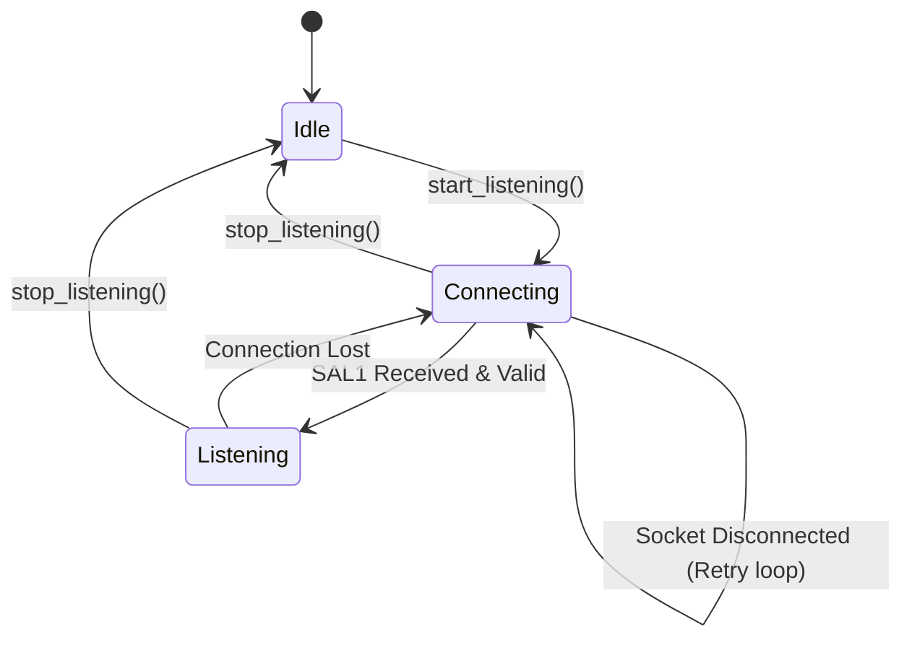

# ShareAudioLite - Desktop/Mobile Sync Specification

This document provides a highly technical, low-level specification of the **ShareAudioLite** network protocol and pipeline contracts. Use this document to ensure 100% binary compatibility when implementing or syncing the ShareAudioLite protocol on other platforms (such as **Android** or **Web**).

---

## 🎵 1. Audio Stream Core Format

Before any transport or compression occurs, the audio data must match these strict parameters on both ends:

- **Sample Rate**: `48000` Hz (48 kHz)
- **Channels**: `2` (Stereo)
- **Sample Format**: Signed 16-bit PCM (`s16le`)
- **Byte Order**: Little-Endian (low byte first)
- **Interleaving**: Interleaved layout (`Left` sample first, then `Right` sample):
  $$\text{Payload} = [L_0, R_0, L_1, R_1, \dots, L_n, R_n]$$
- **Frame Size**: $1 \text{ frame} = 2 \text{ channels} \times 2 \text{ bytes/sample} = 4 \text{ bytes}$.

---

## 📡 2. Connection Handshake: The `SAL1` Stream Header

Every connection starts with a **16-byte native header** sent by the Transmitter (Server) to the Receiver (Client) immediately upon connection, before any audio payload is transmitted.

### Header Byte Map

| Byte Offset | Field Name | Data Type | Hex Value / Range | Description |
| :--- | :--- | :--- | :--- | :--- |
| `0 - 3` | **Magic** | `char[4]` | `0x53 0x41 0x4C 0x31` | The ASCII string `"SAL1"` |
| `4` | **Version** | `uint8_t` | `0x01` | Protocol Version (currently `1`) |
| `5` | **Audio Mode** | `uint8_t` | `0x01` - `0x03` | `1` = Balanced, `2` = Ultrafast, `3` = Quality |
| `6` | **Codec** | `uint8_t` | `0x01` - `0x02` | `1` = Raw PCM (s16le), `2` = Opus |
| `7` | **Channels** | `uint8_t` | `0x02` | Number of channels (must be `2`) |
| `8` | **Bytes/Sample**| `uint8_t` | `0x02` | Byte size of one sample (must be `2` for s16) |
| `9 - 10` | **Packet Size** | `uint16_t` | Variable (**Big-Endian**)| Size in bytes for PCM modes. `0` for Quality Mode. |
| `11` | **Reserved** | `uint8_t` | `0x00` | Padding reserved for future use |
| `12 - 15` | **Sample Rate** | `uint32_t` | `0x00 0x00 0xBB 0x80` | Sample Rate (**Big-Endian**): Fixed at `48000` |

### Handshake Rules
1. **Transmitter**: Must send this exact header block immediately upon client connection.
2. **Receiver**: Must read exactly 16 bytes. If the magic bytes do not equal `"SAL1"`, or if the parameters (channels, sample rate, bytes per sample) do not match the local audio engine capabilities, the socket must be closed immediately.

---

## ⚡ 3. Transmission Modes & Framing Specifications

### 3.1. Balanced Mode (PCM Raw)
- **Audio Mode Header Value**: `0x01`
- **Codec Header Value**: `0x01` (Raw PCM)
- **Packet Size Header Value**: `2048` (`0x08 0x00`)
- **Samples Per Packet**: $2048 \text{ bytes} \div 4 \text{ bytes/frame} = 512 \text{ frames}$ ($512 \text{ samples/channel}$)
- **Packet Duration**: $512 \div 48000 \text{ Hz} \approx 10.67\text{ ms}$
- **Transmission Model**: Continuous, uninterrupted stream of 2048-byte raw PCM blocks. There are no packet separators or delimiters. The receiver reads blocks of exactly 2048 bytes recursively.

### 3.2. Ultrafast Mode (PCM Raw, Ultra-Low Latency)
- **Audio Mode Header Value**: `0x02`
- **Codec Header Value**: `0x01` (Raw PCM)
- **Packet Size Header Value**: `1024` (`0x04 0x00`)
- **Samples Per Packet**: $1024 \text{ bytes} \div 4 \text{ bytes/frame} = 256 \text{ frames}$ ($256 \text{ samples/channel}$)
- **Packet Duration**: $256 \div 48000 \text{ Hz} \approx 5.33\text{ ms}$
- **Transmission Model**: Continuous, uninterrupted stream of 1024-byte raw PCM blocks. The receiver reads blocks of exactly 1024 bytes recursively.

### 3.3. Quality Mode (Opus Compressed)
- **Audio Mode Header Value**: `0x03`
- **Codec Header Value**: `0x02` (Opus)
- **Packet Size Header Value**: `0` (`0x00 0x00`)
- **Encoder Frame Size**: `960` samples/channel (20ms frame size).
- **PCM Bytes per Raw Frame**: $960 \text{ frames} \times 4 \text{ bytes/frame} = 3840 \text{ bytes}$.
- **Opus Bitrate**: `128000` bps (128 kbps), Constant Bitrate (CBR), VBR disabled.
- **Framing & Framing Protocol**:
  Because Opus produces variable-length compressed payloads, each compressed packet is prefixed with a **2-byte Big-Endian unsigned integer** indicating the payload length.
  ```
  +--------------------------------+--------------------------------+
  |    Byte 0: Length High Byte    |     Byte 1: Length Low Byte    |
  +--------------------------------+--------------------------------+
  |                   Opus Payload Data (N Bytes)                   |
  |                              ...                               |
  +-----------------------------------------------------------------+
  ```
- **Receiver Decoding Steps**:
  1. Read exactly 2 bytes from the stream.
  2. Parse the bytes as a 16-bit Big-Endian integer representing $N$.
  3. Read exactly $N$ bytes representing the compressed Opus frame.
  4. Feed the $N$-byte frame into the Opus decoder, yielding exactly $3840$ bytes of raw PCM (960 stereo samples).

---

## 🔄 4. State Sync & Reconnection Requirements

To maintain a robust connection, both desktop and mobile applications must implement matching state machine transitions:



### Reconnection Rules for Clients
1. **Network Disruption**: When a socket read error or timeout occurs in the `Listening` state:
   - Immediately transition the UI status to `Connecting`.
   - **Mute / Stop Playback**: Stop submitting audio frames to the platform API and clear the jitter buffer immediately to prevent loop static or high-pitch artifacts.
   - Enter a loop attempting to reconnect to the transmitter IP every 1.5 seconds.
2. **Reconnection Handshake**: Once the socket reconnects, the client MUST re-read the 16-byte `SAL1` header and validate the parameters before resuming the packet read loop.

---

## 🎛️ 5. Jitter Buffer & Latency Tuning

To absorb network packets variations on wireless LANs (Wi-Fi), a thread-safe jitter buffer must be placed between the socket reader and the audio output device.

### Recommended Implementation Details
- **Buffer Capacity**:
  - Balanced Mode: Recommended capacity of 8 packets ($16384$ bytes, $\approx 85\text{ ms}$).
  - Ultrafast Mode: Recommended capacity of 8 packets ($8192$ bytes, $\approx 42\text{ ms}$).
  - Quality Mode: Recommended capacity of 4 packets ($15360$ bytes PCM output, $\approx 80\text{ ms}$).
- **Underflow Management**: If the buffer runs out of frames during audio playback, the reader must feed **silent frames** (bytes initialized to `0`) into the playback API rather than blocking or starving the sound card.
